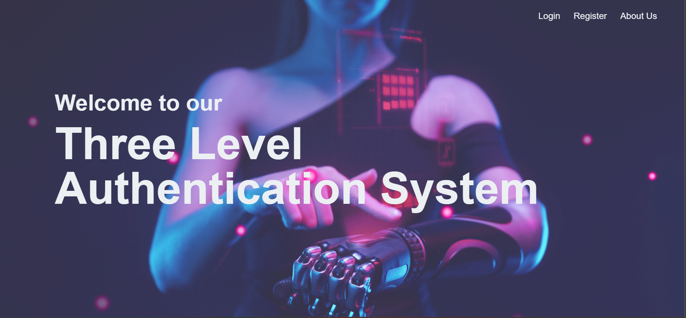
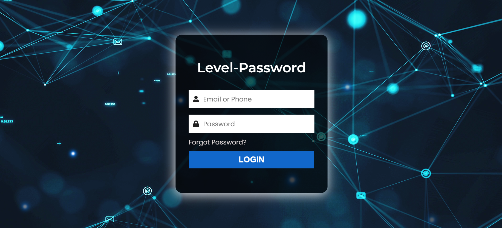
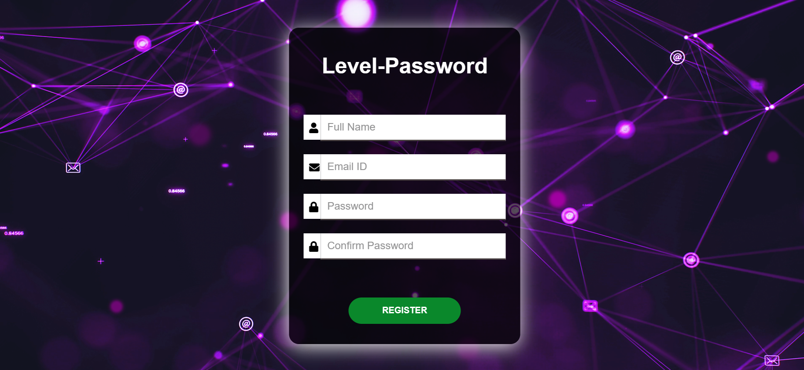
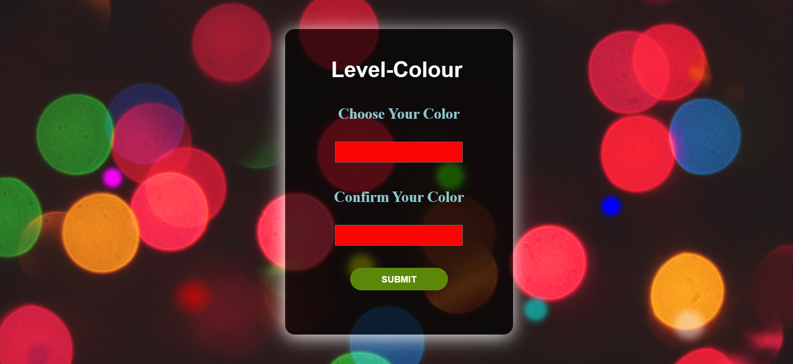
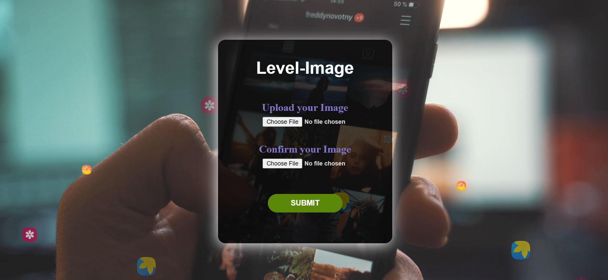
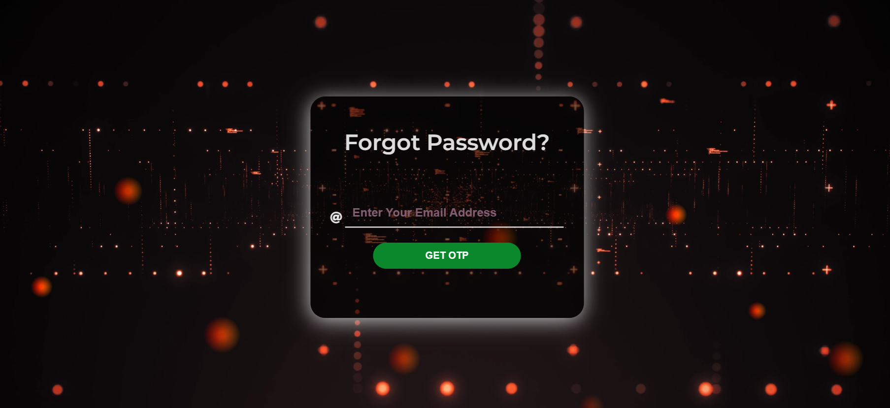

<h1 align="center">Three Level Authentication System using PHP</h1>

---

## 📝 Table of Contents

- [About](#about)
- [Getting Started](#getting_started)
- [Screenshots](#screenshots)

## 🧐 About 

In this website there are three authentication scenario which are text- based, color-based and image-based Password. Authentication, security, and confidentiality are some of the most important topics of cyber security. There have been many solutions presented to users for strengthening the security of login password-based authentication methods.

## 🏁 Getting Started 

### Prerequisites

To set this web application, make sure PHP and PHPMyAdmin is installed on your server.

### Installing

1. Open PHPMyAdmin, create a database name 'three_level_authentication' and import the three_level_authentication.sql file from database folder . This will generate tables in your database on your server.

2. Once this is done, go to the url of your website and it should be up and running.

## 📄 Screenshots 

<h2 align="center">Landing Page</h2>

<h2 align="center">About Us Page</h2>

<h2 align="center">Login Page</h2>

<h2 align="center">Level 1 : Register With Password</h2>

<h2 align="center">Level 2 : Register With Color Code</h2>

<h2 align="center">Level 3: Register With Image verification </h2>

<h2 align="center">Forgot Password </h2>

<h2 align="center">Thank You Page</h2>

### If you like my project hit star button of the repo to support the project....
